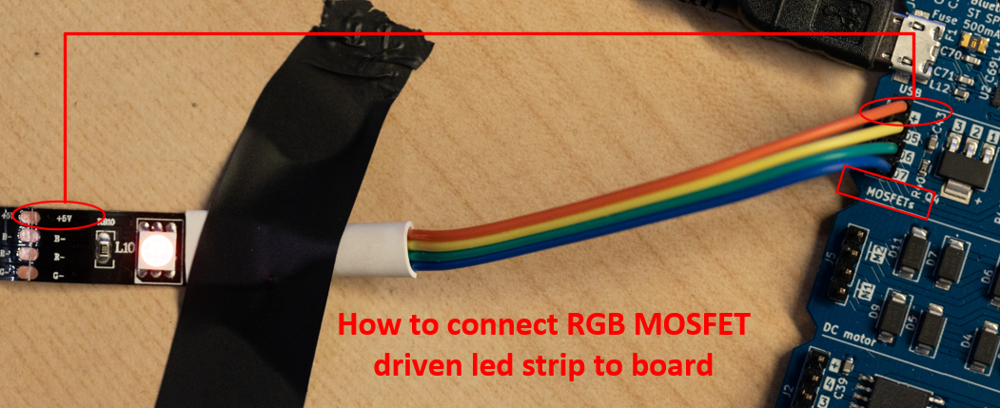
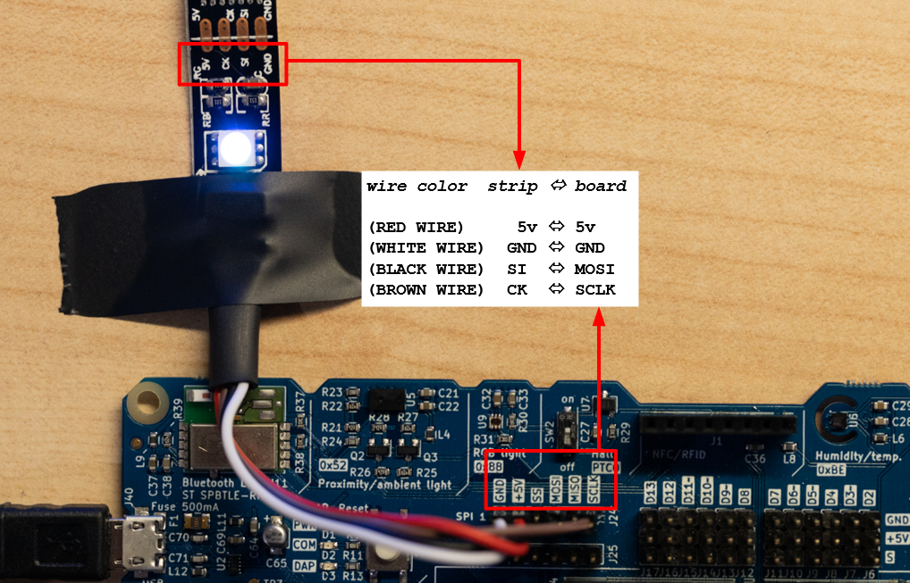

# LED Strips
-------
Example for the parallel usage of a MOSFET driven led strip and a SPI controlled led strip (WS28015). Implemented using [threads](https://os.mbed.com/users/candre97/code/multithread//file/233a2fac1911/main.cpp/). 

## Wiring
### MOSFET driven led strip

### SPI driven led strip

## Sources
 - [iotkitv3 SPI led](https://github.com/iotkitv3/spi#rgb-led-streifen)
 - [multi threading](https://os.mbed.com/users/candre97/code/multithread//file/233a2fac1911/main.cpp/)
 - [iotkitv3 MOSFET led](https://github.com/iotkitv3/actors#rgb-led-streifen)